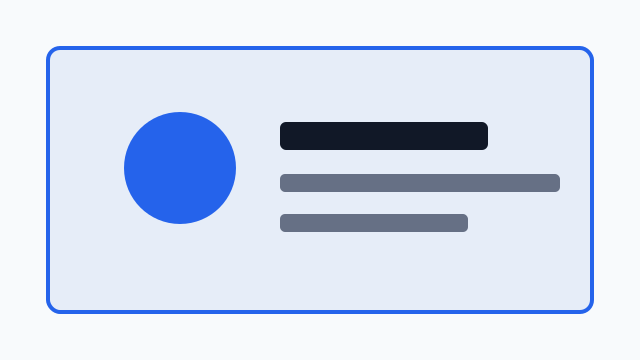

# サンプル

本文です。

## セクションA

ここはセクションAです。

### 詳細A-1

- 項目1
- 項目2

#### 補足A-1-1

スクロール確認用の本文です。

スクロール確認用の本文です。

スクロール確認用の本文です。

### 詳細A-2

スクロール確認用の本文です。

スクロール確認用の本文です。

#### 補足A-2-1

スクロール確認用の本文です。

スクロール確認用の本文です。

## セクションB

セクションBの本文です。現在位置のナビゲーション確認に使います。

### 詳細B-1

スクロールしてこの見出しが現在位置として扱われるかを確認します。

#### 補足B-1-1

本文が短いとページ末尾に届いてしまい、見出しが判定ラインまで上がらないことがあります。

そのため、ここでは少し長めに文章を置いています。

### 詳細B-2

目次ではセクションB配下の見出しがハイライトされる想定です。

#### 補足B-2-1

スクロール確認用の本文です。

スクロール確認用の本文です。

## セクションC

スクロール確認用の本文です。

### 詳細C-1

通常の段落です。**太字**、*斜体*、`inline code`、[リンク](https://example.com) を含めています。

> 引用の確認です。
> 複数行の引用も確認します。

スクロール確認用の本文です。

#### 補足C-1-1

1. 番号付きリスト
2. 2つ目の項目
3. 3つ目の項目

スクロール確認用の本文です。

スクロール確認用の本文です。

### 詳細C-2

---

スクロール確認用の本文です。

#### 補足C-2-1

```ts
type User = {
  id: string;
  name: string;
};

const user: User = { id: "1", name: "Taro" };
```

スクロール確認用の本文です。

スクロール確認用の本文です。

## セクションD

スクロール確認用の本文です。

### 詳細D-1

`code` と **strong** の確認。

#### 補足D-1-1

スクロール確認用の本文です。

スクロール確認用の本文です。

### 詳細D-2

| 名前 | 役割 | 状態 |
| --- | --- | --- |
| parser | MarkdownをHTMLに変換 | 確認中 |
| toc | 見出し一覧を表示 | 動作中 |
| viewer | 本文を表示 | 動作中 |

スクロール確認用の本文です。

#### 補足D-2-1

ネストしたリストの確認です。

- 親項目A
  - 子項目A-1
  - 子項目A-2
- 親項目B
  - 子項目B-1

スクロール確認用の本文です。

スクロール確認用の本文です。

## セクションE

スクロール確認用の本文です。

### 詳細E-1

スクロール確認用の本文です。

#### 補足E-1-1

スクロール確認用の本文です。

スクロール確認用の本文です。

### 詳細E-2

HTMLは無効化しているので、次の文字列はHTMLとして実行されずエスケープされます。

<div>これはHTMLタグの確認です。</div>

スクロール確認用の本文です。

#### 補足E-2-1

バックスラッシュエスケープの確認です。

\*これは強調ではありません\*

スクロール確認用の本文です。

スクロール確認用の本文です。

## セクションF

スクロール確認用の本文です。

### 詳細F-1

画像表示の確認です。



スクロール確認用の本文です。

#### 補足F-1-1

スクロール確認用の本文です。

スクロール確認用の本文です。

### 詳細F-2

スクロール確認用の本文です。

#### 補足F-2-1

スクロール確認用の本文です。

スクロール確認用の本文です。
